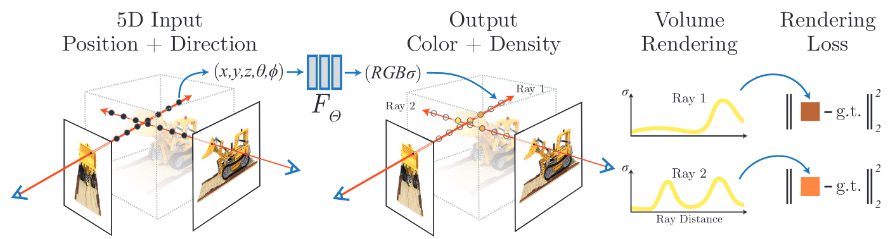
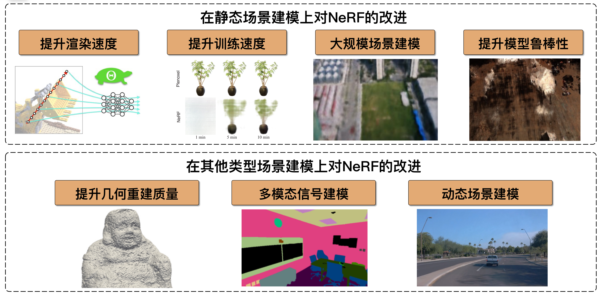

A curated list of papers and open-source resources focused on NeRF, inspired by [awesome-NeRF](https://github.com/awesome-NeRF/awesome-NeRF) and [nerf_and_beyond](https://github.com/yangjiheng/nerf_and_beyond_docs).

## Table of Content
- [Table of Content](#table-of-content)
- [❓️What's NeRF](#️whats-nerf)
  - [NeRF-Related Survey](#nerf-related-survey)
  - [To Be Solved](#to-be-solved)
- [Higher Quality NVS](#higher-quality-nvs)
- [Faster Inference](#faster-inference)
- [Faster Training](#faster-training)
- [Generalizable Reconstruction](#generalizable-reconstruction)
- [🤩Surface Reconstrucion](#surface-reconstrucion)
  - [Object](#object)
  - [Indoor Scene](#indoor-scene)
  - [Outdoor Scene](#outdoor-scene)
- [Pose-free Reconstruction](#pose-free-reconstruction)
- [Large Scene Reconstruction](#large-scene-reconstruction)
- [🤩Sparse-View Reconstruction](#sparse-view-reconstruction)
- [🤩NeRF-based SLAM](#nerf-based-slam)
- [🤩Scene Understanding](#scene-understanding)

## ❓️What's NeRF
- 🔥**NeRF: Representing Scenes as Neural Radiance Fields for View Synthesis**, Mildenhall et al., ECCV2020 (Oral and Best Paper Honorable Mention) | [arXiv](https://arxiv.org/abs/2003.08934) | [project](https://www.matthewtancik.com/nerf) | [code](https://github.com/bmild/nerf) | [pytorch impl](https://github.com/yenchenlin/nerf-pytorch) | [notes](https://yconquesty.github.io/blog/ml/nerf/nerf_rendering.html#analysis)

### NeRF-Related Survey
- **Neural Volume Rendering: NeRF And Beyond**, Dellaert and Yen-Chen, arXiv2021 | [arXiv](https://arxiv.org/abs/2101.05204) | [blog](https://dellaert.github.io/NeRF/)
- 🔥**NeRF: Neural Radiance Field in 3D Vision, A Comprehensive Review**, Kyle Gao et al., TPAMI2022 | [arXiv](https://arxiv.org/abs/2210.00379)

### To Be Solved
Refer to "NeRF Tutorial" presented by Sida Peng in Valse2024

  
Note that 3DGS has solved the problem of slow inference and training, enbaling large-scale scene reconstruction while achieving better rendering quality.

## Higher Quality NVS
- **Mip-NeRF: A Multiscale Representation for Anti-Aliasing Neural Radiance Fields**, Jonathan T.Barron et al., ICCV2021 (Oral) | [arXiv](https://arxiv.org/abs/2103.13415) | [project](https://jonbarron.info/mipnerf/) | [code](https://github.com/google/mipnerf)
- **NerfingMVS: Guided Optimization of Neural Radiance Fields for Indoor Multi-view Stereo**，Yi Wei et al, ICCV2021 (Oral) | [arXiv](https://arxiv.org/abs/2109.01129) | [project](https://weiyithu.github.io/NerfingMVS/) | [code](https://github.com/weiyithu/NerfingMVS)
- 🔥**Mip-NeRF 360: Unbounded Anti-Aliased Neural Radiance Fields**, Jonathan T.Barron et al., CVPR2022 (Oral) | [arXiv](https://arxiv.org/abs/2111.12077) | [project](https://jonbarron.info/mipnerf360/) | [code](https://github.com/google-research/multinerf)
- **Ref-NeRF: Structured View-Dependent Appearance for Neural Radiance Fields**, Dor Verbin et al., CVPR2022 (Oral and Best Student Paper Honorable Mention) | [arXiv](https://arxiv.org/abs/2112.03907) | [project](https://dorverbin.github.io/refnerf/) | [code](https://github.com/google-research/multinerf)
- **Tri-MipRF: Tri-Mip Representation for Efficient Anti-Aliasing Neural Radiance Fields**, Wenbo Hu et al, ICCV2023 (Oral and Benst Paper Finalist) | [arXiv](https://arxiv.org/abs/2307.11335) | [project](https://wbhu.github.io/projects/Tri-MipRF/) | [code](https://github.com/wbhu/Tri-MipRF)
- 🔥**Zip-NeRF: Anti-Aliased Grid-Based Neural Radiance Fields**, Jonathan T. Barron et al, ICCV2023 (Oral and Best Paper Finalist) | [arXiv](https://arxiv.org/abs/2304.06706) | [project](https://jonbarron.info/zipnerf/) | [unofficial_impl](https://github.com/SuLvXiangXin/zipnerf-pytorch)
- 🔥**Rip-NeRF: Anti-aliasing Radiance Fields with Ripmap-Encoded Platonic Solids**, Junchen Liu et al, SIGGRAPH2024 | [arXiv](https://arxiv.org/abs/2405.02386) | [project](https://junchenliu77.github.io/Rip-NeRF/) | [code](https://github.com/JunchenLiu77/Rip-NeRF)

## Faster Inference
- **Neural Sparse Voxel Fields**, Liu et al., NeurIPS2020 (Spotlight) | [arXiv](https://arxiv.org/abs/2007.11571)| [project](https://github.com/facebookresearch/NSVF) | [code](https://github.com/facebookresearch/NSVF)
- 🔥**KiloNeRF: Speeding up Neural Radiance Fields with Thousands of Tiny MLPs**, Reiser et al., ICCV2021 | [arXiv](https://arxiv.org/abs/2103.13744) | [project](https://creiser.github.io/kilonerf/) | [code](https://github.com/creiser/kilonerf) 
- 🔥**PlenOctrees for Real-time Rendering of Neural Radiance Fields**, Alex Yu et al, ICCV2021 (Oral) | [arXiv](https://arxiv.org/abs/2103.14024) | [project](https://alexyu.net/plenoctrees/) | [code](https://github.com/sxyu/plenoctree)
- **MobileNeRF: Exploiting the Polygon Rasterization Pipeline for Efficient Neural Field Rendering on Mobile Architectures**, Zhiqin Chen et al., CVPR2023 (Award Candidates) | [arXiv](https://arxiv.org/abs/2208.00277) | [project](https://mobile-nerf.github.io/) | [code](https://github.com/google-research/jax3d/tree/main/jax3d/projects/mobilenerf)

## Faster Training
- 🔥**NeurMiPs: Neural Mixture of Planar Experts for View Synthesis**, Zhihao Lin et al, CVPR2022 | [arXiv](https://arxiv.org/abs/2204.13696) | [project](https://zhihao-lin.github.io/neurmips/) | [code](https://github.com/zhihao-lin/neurmips)
- 🔥**Plenoxels: Radiance Fields without Neural Networks**, Alex Yu et al, CVPR2022 (Oral) | [arXiv](https://arxiv.org/abs/2112.05131) | [project](https://alexyu.net/plenoxels/) | [code](https://github.com/sxyu/svox2)
- 🔥**Direct Voxel Grid Optimization: Super-fast Convergence for Radiance Fields Reconstruction**, Cheng Sun et al, CVPR2022 (Oral) | [arXiv](https://arxiv.org/abs/2111.11215) | [project](https://sunset1995.github.io/dvgo/) | [code](https://github.com/sunset1995/DirectVoxGO)
- **TensoRF: Tensorial Radiance Fields**, Chen et al., ECCV 2022 (Most influential ECCV'22 papers) | [arXiv](https://arxiv.org/abs/2203.09517) | [project](https://apchenstu.github.io/TensoRF/) | [code](https://github.com/apchenstu/TensoRF)
- 🔥**Instant Neural Graphics Primitives with a Multiresolution Hash Encoding**, Thomas Müller et al, SIGGRAPH2022 (Best Paper Award) | [arXiv](https://arxiv.org/abs/2112.05131) | [project](https://nvlabs.github.io/instant-ngp/) | [code](https://github.com/NVlabs/instant-ngp)

## Generalizable Reconstruction
- **PixelNeRF: Neural Radiance Fields from One or Few Images**, Alex Yu et al, CVPR2021 | [arXiv](https://arxiv.org/abs/2012.02190) | [project](https://alexyu.net/pixelnerf/) | [code](https://github.com/sxyu/pixel-nerf) 
- **IBRNet: Learning Multi-View Image-Based Rendering**, Qianqian Wang et al, CVPR2021 | [arXiv](https://arxiv.org/abs/2102.13090) | [project](https://ibrnet.github.io/) | [code](https://github.com/googleinterns/IBRNet)
- 🔥**MVSNeRF: Fast Generalizable Radiance Field Reconstruction from Multi-View Stereo**, Anpei Chen et al, ICCV2021 | [arXiv](https://arxiv.org/abs/2103.15595) | [project](https://apchenstu.github.io/mvsnerf/) | [code](https://github.com/apchenstu/mvsnerf)
- **Neural Rays for Occlusion-Aware Image-Based Rendering**, Yuan Liu et al, CVPR2022 | [arXiv](https://arxiv.org/abs/2107.13421) | [project](https://liuyuan-pal.github.io/NeuRay/) | [code](https://github.com/liuyuan-pal/NeuRay)
- **NeRFusion: Fusing Radiance Fields for Large-Scale Scene Reconstruction**, Xiaoshuai Zhang et al, CVPR2022 (Oral) | [arXiv](https://arxiv.org/abs/2203.11283) | [project](https://jetd1.github.io/NeRFusion-Web/)
- 🔥**Point-NeRF: Point-based Neural Radiance Fields**, Qiangeng Xu et al, CVPR2022 (oral) | [arXiv](https://arxiv.org/pdf/2201.08845.pdf) | [project](https://xharlie.github.io/projects/project_sites/pointnerf/index.html) | [code](https://github.com/Xharlie/pointnerf)
- 🔥**SurfelNeRF: Neural Surfel Radiance Fields for Online Photorealistic Reconstruction of Indoor Scenes**, Yiming Gao et al, CVPR2023 | [arXiv](https://arxiv.org/abs/2304.08971) | [project](https://gymat.github.io/SurfelNeRF-web/) | [ code](https://github.com/Gymat/SurfelNeRF/tree/unofficial)
- **FreeNeRF: Improving Few-shot Neural Rendering with Free Frequency Regularization**, Jiawei Yang et al, CVPR2023 | [arXiv](https://arxiv.org/abs/2303.07418) | [project](https://jiawei-yang.github.io/FreeNeRF/) | [code](https://github.com/Jiawei-Yang/FreeNeRF)
- 🔥**ReconFusion: 3D Reconstruction with Diffusion Priors**, Rundi Wu et al, arXiv 2023 | [arXiv](https://arxiv.org/abs/2312.02981) | [project](https://reconfusion.github.io/)

## 🤩Surface Reconstrucion
### Object
- **UNISURF: Unifying Neural Implicit Surfaces and Radiance Fields for Multi-View Reconstruction**, Michael Oechsle et al., ICCV2021 (Oral) | [arXiv](https://arxiv.org/abs/2104.10078) | [project](https://moechsle.github.io/unisurf/) | [code](https://github.com/autonomousvision/unisurf) 
- **Volume Rendering of Neural Implicit Surfaces**, Lior Yariv et al, NIPS2021 (Oral) | [arXiv](https://arxiv.org/abs/2106.12052) | [project](https://lioryariv.github.io/volsdf/) | [code](https://github.com/lioryariv/volsdf)
- 🔥**NeuS: Learning Neural Implicit Surfaces by Volume Rendering for Multi-view Reconstruction**, Peng Wang et al, NIPS2021 (Spotlight) | [arXiv](https://arxiv.org/abs/2106.10689) | [project](https://lingjie0206.github.io/papers/NeuS/) | [code](https://github.com/Totoro97/NeuS)
- **Geo-Neus: Geometry-Consistent Neural Implicit Surfaces Learning for Multi-view Reconstruction**, Qiancheng Fu et al, NIPS2022| [arXiv](https://arxiv.org/abs/2205.15848) | [code](https://github.com/GhiXu/Geo-Neus) 
- **Vox-Surf: Voxel-based Implicit Surface Representation**, Hai Li et al, TVCG2022 | [arXiv](https://arxiv.org/pdf/2208.10925) | [code](https://github.com/zju3dv/Vox-Surf)
- **Voxurf: Voxel-based Efficient and Accurate Neural Surface Reconstruction**, Tong Wu et al, ICLR2023 (Spotlight) | [arXiv](https://arxiv.org/abs/2208.12697) | [code](https://github.com/wutong16/Voxurf)
- **NeuDA: Neural Deformable Anchor for High-Fidelity Implicit Surface Reconstruction**, Bowen Cai et al, CVPR2023 | [arXiv](https://arxiv.org/abs/2303.02375) | [project](https://3d-front-future.github.io/neuda/) | [code](https://github.com/3D-FRONT-FUTURE/NeuDA)
- 🔥**Towards Better Gradient Consistency for Neural Signed Distance Functions via Level Set Alignment**, Baorui Ma et al, CVPR2023 | [arXiv](https://arxiv.org/abs/2305.11601) | [code](https://github.com/mabaorui/TowardsBetterGradient) 
- **Towards Unbiased Volume Rendering of Neural Implicit Surfaces with Geometry Priors**, Yongqiang Zhang et al, CVPR2023 | [paper](https://openaccess.thecvf.com/content/CVPR2023/papers/Zhang_Towards_Unbiased_Volume_Rendering_of_Neural_Implicit_Surfaces_With_Geometry_CVPR_2023_paper.pdf)
- **NeuS2: Fast Learning of Neural Implicit Surfaces for Multi-view Reconstruction**, Yiming Wang et al, ICCV2023 | [arXiv](https://arxiv.org/abs/2212.05231) | [project](https://vcai.mpi-inf.mpg.de/projects/NeuS2/) | [code](https://github.com/19reborn/NeuS2)
- 🔥**Neuralangelo: High-Fidelity Neural Surface Reconstruction**, Zhaoshuo Li et al, CVPR2023 | [arXiv](https://arxiv.org/abs/2306.03092) | [project](https://research.nvidia.com/labs/dir/neuralangelo/) | [code](https://github.com/nvlabs/neuralangelo)

### Indoor Scene
- **GO-Surf: Neural Feature Grid Optimization for Fast, High-Fidelity RGB-D Surface Reconstruction**, Jingwen Wang et al, 3DV 2022 (Oral) | [arXiv](https://arxiv.org/abs/2206.14735) | [project](https://jingwenwang95.github.io/go_surf/) | [code](https://github.com/JingwenWang95/go-surf)
- **Neural RGB-D Surface Reconstruction**, Dejan Azinović et al, CVPR 2022 | [arXiv](https://arxiv.org/abs/2104.04532) | [project](https://dazinovic.github.io/neural-rgbd-surface-reconstruction/) | [code](https://github.com/dazinovic/neural-rgbd-surface-reconstruction)
- 🔥**Neural 3D Scene Reconstruction with the Manhattan-world Assumption**, Haoyu Guo et al, CVPR2022 (Oral) | [arXiv](https://arxiv.org/abs/2205.02836) | [project](https://zju3dv.github.io/manhattan_sdf/) | [code](https://github.com/zju3dv/manhattan_sdf)
- 🔥**NeuRIS: Neural Reconstruction of Indoor Scenes Using Normal Priors**, Jiepeng Wang et al, ECCV2022 | [arXiv](https://arxiv.org/abs/2206.13597) | [project](https://jiepengwang.github.io/NeuRIS/) | [code](https://github.com/jiepengwang/NeuRIS)
- 🔥**MonoSDF: Exploring Monocular Geometric Cues for Neural Implicit Surface Reconstruction**, Zehao Yu et al, NIPS2022 | [arXiv](https://arxiv.org/pdf/2206.00665) | [project](https://niujinshuchong.github.io/monosdf/) | [code](https://github.com/autonomousvision/monosdf)
- **Fast Monocular Scene Reconstruction with Global-Sparse Local-Dense Grids**, Wei Dong et al, CVPR2023 | [arXiv](https://arxiv.org/abs/2305.13220) | [project](https://dongwei.info/publication/ash-mono/) | [code](https://github.com/theNded/torch-ash) 
- 🔥**HelixSurf: A Robust and Efficient Neural Implicit Surface Learning of Indoor Scenes with Iterative Intertwined Regularization**, Zhihao Liang et al, CVPR2023 | [arXiv](https://arxiv.org/abs/2302.14340) | [project](https://lzhnb.github.io/project-pages/helixsurf.html) | [code](https://github.com/Gorilla-Lab-SCUT/HelixSurf?tab=readme-ov-file) 
- 🔥**Self-supervised Super-plane for Neural 3D Reconstruction**, Botao Ye et al, CVPR2023 | [paper](https://openaccess.thecvf.com/content/CVPR2023/papers/Ye_Self-Supervised_Super-Plane_for_Neural_3D_Reconstruction_CVPR_2023_paper.pdf) | [code](https://github.com/botaoye/S3PRecon) 
- **DebSDF: Delving into the Details and Bias of Neural Indoor Scene Reconstruction**, Yuting Xiao et al, TPAMI2024 | [arXiv](https://arxiv.org/abs/2308.15536) | [project](https://davidxu-jj.github.io/pubs/DebSDF/) | [code](https://github.com/DavidXu-JJ/DebSDF)
- 🔥**PhyRecon: Physically Plausible Neural Scene Reconstruction**, Junfeng Ni, arXiv2024 | [arXiv](https://arxiv.org/abs/2404.16666) | [project](https://phyrecon.github.io/) | [code](https://github.com/PhyRecon/PhyRecon)

### Outdoor Scene
NeRF-based:
- **Neural 3D Reconstruction in the Wild**, Jiaming Sun et al, SIGGRAPH2022 | [arXiv](https://arxiv.org/pdf/2205.12955) | [project](https://zju3dv.github.io/neuralrecon-w/) | [code](https://github.com/zju3dv/NeuralRecon-W)

## Pose-free Reconstruction
- **NeRF--: Neural Radiance Fields Without Known Camera Parameters**, Zirui Wang et al, arXiv2021 | [arXiv](https://arxiv.org/abs/2102.07064) | [project](https://nerfmm.active.vision/) | [code](https://github.com/ActiveVisionLab/nerfmm)
- **BARF: Bundle-Adjusting Neural Radiance Fields**, Chen-Hsuan Lin et al., ICCV2021 (Oral) | [arXiv](https://arxiv.org/abs/2104.06405) | [project](https://chenhsuanlin.bitbucket.io/bundle-adjusting-NeRF/) | [code](https://github.com/chenhsuanlin/bundle-adjusting-NeRF)
- **NoPe-NeRF: Optimising Neural Radiance Field with No Pose Prior**, Wenjing Bian et al, CVPR2023 (Highlight) | [arXiv](https://arxiv.org/abs/2212.07388) | [project](https://nope-nerf.active.vision/) | [code](https://github.com/ActiveVisionLab/nope-nerf/)

## Large Scene Reconstruction
- 🔥**NeRF++: Analyzing and Improving Neural Radiance Fields**, Kai zhang et al, arXiv 2020 | [arXiv](https://arxiv.org/abs/2010.07492) | [code](https://github.com/Kai-46/nerfplusplus)
- **Mega-NeRF: Scalable Construction of Large-Scale NeRFs for Virtual Fly-Throughs**, Haithem Turki et al, CVPR2022 | [arXiv](https://arxiv.org/abs/2112.10703) | [project](https://meganerf.cmusatyalab.org/) | [code](https://github.com/cmusatyalab/mega-nerf)
- **Block-NeRF: Scalable Large Scene Neural View Synthesis**, Matthew Tancik et al, CVPR2022 | [arXiv](https://arxiv.org/abs/2202.05263) | [project](https://waymo.com/intl/zh-cn/research/block-nerf/)
- **BungeeNeRF: Progressive Neural Radiance Field for Extreme Multi-scale Scene Rendering**, Yuanbo Xiangli et al, ECCV2022 | [arXiv](https://arxiv.org/abs/2112.05504) | [project](https://city-super.github.io/citynerf/) | [code](https://github.com/city-super/BungeeNeRF)
- 🔥**F2-NeRF: Fast Neural Radiance Field Training with Free Camera Trajectories**, Peng Wang et al, CVPR2023 (Highlight) | [arXiv](https://arxiv.org/abs/2303.15951) | [project](https://totoro97.github.io/projects/f2-nerf/) | [code](https://github.com/totoro97/f2-nerf) 

## 🤩Sparse-View Reconstruction
Some works in Generalizable Reconstruction can also be used for Sparse-View Reconstruction
- **Depth-supervised NeRF: Fewer Views and Faster Training for Free**, Kangle Deng et al, CVPR2022 | [arXiv](https://arxiv.org/abs/2107.02791) | [project](https://www.cs.cmu.edu/~dsnerf/) | [code](https://github.com/dunbar12138/DSNeRF)
- 🔥**Dense Depth Priors for Neural Radiance Fields from Sparse Input Views**, Barbara Roessle et al, CVPR2022 | [arXiv](https://arxiv.org/abs/2112.03288) | [project](https://barbararoessle.github.io/dense_depth_priors_nerf/) | [code](https://github.com/barbararoessle/dense_depth_priors_nerf)
- **RegNeRF: Regularizing Neural Radiance Fields for View Synthesis from Sparse Inputs**, Michael Niemeyer et al, CVPRP2022 (Oral) | [arXiv](https://arxiv.org/abs/2112.00724) | [project](https://m-niemeyer.github.io/regnerf/index.html) | [code](https://github.com/google-research/google-research/tree/master/regnerf)

## 🤩NeRF-based SLAM
Refer to [awesome-Implicit-NeRF-SLAM](https://github.com/DoongLi/awesome-Implicit-NeRF-SLAM), semnatic-SLAMs are listed in [Awesome-3D-Scene-Understanding](Awesome-3D-Scene-Understanding.md)
- 🔥**iMAP: Implicit Mapping and Positioning in Real-Time**, Edgar Sucar et al, ICCV2021 | [arXiv](https://arxiv.org/abs/2103.12352) | [project](https://edgarsucar.github.io/iMAP/)
- **Vox-Fusion:Dense Tracking and Mapping with Voxel-based Neural Implicit Representation**, Xingrui Yang et al, ISMAR2022 | [arXiv](https://arxiv.org/abs/2210.15858) | [project](https://zju3dv.github.io/Vox-Fusion/) | [code](https://github.com/zju3dv/Vox-Fusion)
- 🔥**vMAP: Vectorised Object Mapping for Neural Field SLAM**, Xin Kong et al, CVPR2023 | [arXiv](https://arxiv.org/abs/2302.01838) | [project](https://kxhit.github.io/vMAP) | [code](https://github.com/kxhit/vMAP)
- **NICE-SLAM: Neural Implicit Scalable Encoding for SLAM**, Zihan Zhu et al, CVPR2022 | [arXiv](https://arxiv.org/abs/2112.12130) | [project](https://pengsongyou.github.io/nice-slam?utm_source=catalyzex.com) | [code](https://github.com/cvg/nice-slam)
- **Co-SLAM: Joint Coordinate and Sparse Parametric Encodings for Neural Real-Time SLAM**, Hengyi Wang et al, CVPR2023 | [arXiv](https://arxiv.org/pdf/2304.14377.pdf) | [project](https://hengyiwang.github.io/projects/CoSLAM) | [code](https://github.com/HengyiWang/Co-SLAM)
- **MIPS-Fusion: Multi-Implicit-Submaps for Scalable and Robust Online Neural RGB-D Reconstruction**, Yijie Tang et al, TOG 2023 | [arXiv](https://arxiv.org/abs/2308.08741)
- **H2-Mapping: Real-time Dense Mapping Using Hierarchical Hybrid Representation**, Chenxing Jiang et al, RA-L2023(Best Paper Award) | [arXiv](https://arxiv.org/abs/2306.03207) | [code](https://github.com/SYSU-STAR/H2-Mapping)
- **NICER-SLAM: Neural Implicit Scene Encoding for RGB SLAM**, Zihan Zhu et al, 3DV2024 (Oral and Best Paper Honorable Mention) | [arXiv](https://drive.google.com/file/d/15IwFnyt2Oao5j-qHnPXqL4K1zuAHLIPD/view?usp=sharing) | [project](https://nicer-slam.github.io/) | [code](https://github.com/cvg/nicer-slam)

## 🤩Scene Understanding
Related Papers are listed in [Awesome-3D-Scene-Understanding](Awesome-3D-Scene-Understanding.md)

