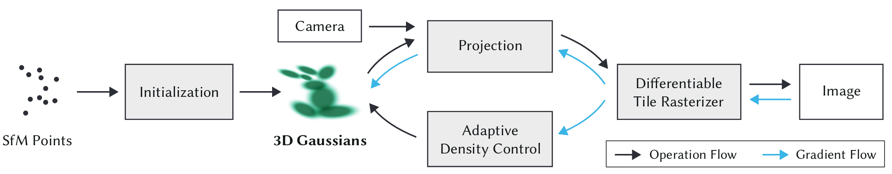

A curated list of papers and open-source resources focused on 3DGS, inspired by [awesome-3D-gaussian-splatting](https://github.com/MrNeRF/awesome-3D-gaussian-splatting) and [3DGS_and_beyond](https://github.com/yangjiheng/3DGS_and_Beyond_Docs).

## Table of Content
- [Table of Content](#table-of-content)
- [❓️What's 3DGS](#️whats-3dgs)
  - [3DGS-Related Survey](#3dgs-related-survey)
- [Higher Quality NVS](#higher-quality-nvs)
- [Better Densification](#better-densification)
- [Large Scene Reconstruction](#large-scene-reconstruction)
- [🤩Surface Reconstruction](#surface-reconstruction)
  - [TSDF-fusion or Poisson Reconstruction](#tsdf-fusion-or-poisson-reconstruction)
  - [Neural SDF/Opacity Field](#neural-sdfopacity-field)
  - [Indoor Scene Reconstruction](#indoor-scene-reconstruction)

## ❓️What's 3DGS
- **3D Gaussian Splatting  for Real-Time Radiance Field Rendering**, Bernhard Kerbl et al, SIGGRAPH2023 (Best Paper) | [arXiv](https://arxiv.org/abs/2308.04079) | [project](https://repo-sam.inria.fr/fungraph/3d-gaussian-splatting/) | [code](https://github.com/graphdeco-inria/gaussian-splatting)

### 3DGS-Related Survey
- **Recent Advances in 3D Gaussian Splatting**,. Tong Wu et al, CVM2024 | [arXiv](https://arxiv.org/abs/2403.11134)

## Higher Quality NVS
- 🔥**Mip-Splatting: Alias-free 3D Gaussian Splatting**, Zehao Yu et al, CVPR2024 (Best Student Paper) | [arXiv](https://arxiv.org/abs/2311.16493) | [project](https://niujinshuchong.github.io/mip-splatting/) | [code](https://github.com/autonomousvision/mip-splatting)
- 🔥**Scaffold-GS: Structured 3D Gaussians for View-Adaptive Rendering**, Tao Lu et al, CVPR2024 (Highlight) | [arXiv](https://arxiv.org/abs/2312.00109) | [project](https://city-super.github.io/scaffold-gs/) | [code](https://github.com/city-super/Scaffold-GS)
- **Analytic-Splatting: Anti-Aliased 3D Gaussian Splatting via Analytic Integration**, Zhihao Liang et al, ECCV2024 | [arXiv](https://arxiv.org/abs/2403.11056) | [project](https://lzhnb.github.io/project-pages/analytic-splatting/) | [code](https://github.com/lzhnb/Analytic-Splatting)

## Better Densification
- **GaussianPro: 3D Gaussian Splatting with Progressive Propagation**, Kai Cheng, ICML2024 | [arXiv](https://arxiv.org/abs/2402.14650) | [project](https://kcheng1021.github.io/gaussianpro.github.io/) | [code](https://github.com/kcheng1021/GaussianPro)

## Large Scene Reconstruction
- **VastGaussian: Vast 3D Gaussians for Large Scene Reconstruction**, Jiaqi Lin et al, CVPR2024 | [arXiv](https://arxiv.org/abs/2402.17427) | [project](https://vastgaussian.github.io/)
- 🔥**Octree-GS: Towards Consistent Real-time Rendering with LOD-Structured 3D Gaussians**, Kerui Ren et al, arXiv 2024 | [arXiv](https://arxiv.org/abs/2403.17898) | [project](https://city-super.github.io/octree-gs/) | [code](https://github.com/city-super/Octree-GS)

## 🤩Surface Reconstruction
### TSDF-fusion or Poisson Reconstruction
- **SuGaR: Surface-Aligned Gaussian Splatting for Efficient 3D Mesh Reconstruction and High-Quality Mesh Rendering**,  Antoine Guédon et al, CVPR2024 | [arXiv](https://arxiv.org/abs/2311.12775) | [project](https://anttwo.github.io/sugar/) | [code](https://github.com/Anttwo/SuGaR) 
- **High-quality Surface Reconstruction using Gaussian Surfels**, Pinxuan Dai et al, SIGGRAPH2024 | [arXiv](https://arxiv.org/abs/2404.17774) | [project](https://turandai.github.io/projects/gaussian_surfels/) | [code](https://github.com/turandai/gaussian_surfels)
- 🔥**2D Gaussian Splatting for Geometrically Accurate Radiance Fields**, Binbin Huang et al, SIGGRAPH 2024 | [arXiv](https://arxiv.org/abs/2403.17888) | [project](https://surfsplatting.github.io/) | [code](https://github.com/hbb1/2d-gaussian-splatting)
- 🔥**RaDe-GS: Rasterizing Depth in Gaussian Splatting**, Bowen Zhang et al, arXiv2024 | [arXiv](https://arxiv.org/abs/2406.01467) | [project](https://baowenz.github.io/radegs/) | [code](https://github.com/BaowenZ/RaDe-GS)
- 🔥**PGSR: Planar-based Gaussian Splatting for Efficient and High-Fidelity Surface Reconstruction**, Danpeng Chen et al, arXiv2024 | [arXiv](https://arxiv.org/abs/2406.06521) | [project](https://zju3dv.github.io/pgsr/) | [code](https://github.com/zju3dv/PGSR)
- **GS2Mesh: Surface Reconstruction from Gaussian Splatting via Novel Stereo Views**, Yaniv Wolf et al, ECCV2024 | [arXiv](https://arxiv.org/abs/2404.01810) | [project](https://gs2mesh.github.io/) | [code](https://github.com/yanivw12/gs2mesh/tree/main)

### Neural SDF/Opacity Field
- **GSDF: 3DGS Meets SDF for Improved Rendering and Reconstruction**, Mulin Yu et al, arXiv2024 | [arXiv](https://arxiv.org/abs/2403.16964) | [project](https://city-super.github.io/GSDF/) | [code](https://github.com/city-super/GSDF)
- 🔥**Gaussian Opacity Fields: Efficient and Compact Surface Reconstruction in Unbounded Scenes**, Zehao Yu et al, arXiv2024 | [arXiv](https://arxiv.org/abs/2404.10772) | [project](https://niujinshuchong.github.io/gaussian-opacity-fields/) | [code](https://github.com/autonomousvision/gaussian-opacity-fields)
- 🔥**3DGSR: Implicit Surface Reconstruction with 3D Gaussian Splatting**, Xiaoyang Lyu et al, arXiv2024 | [arXiv](https://arxiv.org/abs/2404.00409)

### Indoor Scene Reconstruction
- **DN-Splatter: Depth and Normal Priors for Gaussian Splatting and Meshing**, Matias Turkulainen et al, arXiv2024 | [arXiv](https://arxiv.org/abs/2403.17822) | [project](https://maturk.github.io/dn-splatter/) | [code](https://github.com/maturk/dn-splatter)
- **GaussianRoom: Improving 3D Gaussian Splatting with SDF Guidance and Monocular Cues for Indoor Scene Reconstruction**, Haodong Xiang et al, arXiv2024 | [arXiv](https://arxiv.org/abs/2405.19671)
- 🔥**Surface Reconstruction from 3D Gaussian Splatting via Local Structural Hints**, Qianyi Wu et al, ECCV2024 | [pdf](https://wuqianyi.top/media/GSRec.pdf) | [project](https://wuqianyi.top/gsrec) | [code](https://github.com/QianyiWu/gsrec)
